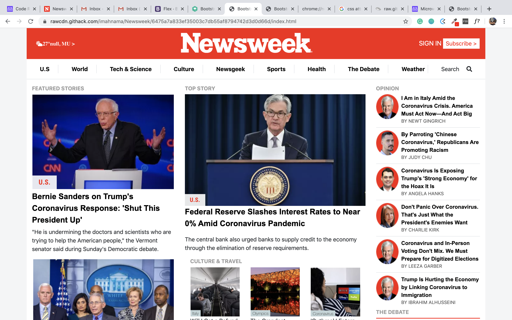

# Bootstrap

> Mastering bootstrap classes

> 

## Built With

- HTML &,
- CSS,
- Bootsrap

## Live Demo

[Live Demo Link](https://raw.githack.com/imahnama/Apple-clone/apple-clone/index.html)

## Getting Started

To get a local copy up and running follow these simple example steps.

### Prerequisites

A browser of your choice preferrably Chrome.

### Setup

Fork this project to your local machine
Open the index.html file in any browser or edit using Visual Code or the preference IDE for web development

## Author

👤 **Rahma Halane**

- Github: [@Imahnama](https://github.com/imahnama)
- Twitter: [@halane_rahma](https://twitter.com/halane_rahma)
- Linkedin: [Rahmahalane](https://linkedin.com/Rahmahalane)

## 🤝 Contributing

Contributions, issues and feature requests are all welcome!

Feel free to check the [issues/](https://github.com/imahnama/Newsweek/issues).

## Show your support

Give a ⭐️ if you like this project!!

## Acknowledgments

- Freecodecamp
- w3schools
- Bootstrap
- Eric & Phylis.

## 📝 License

No License
